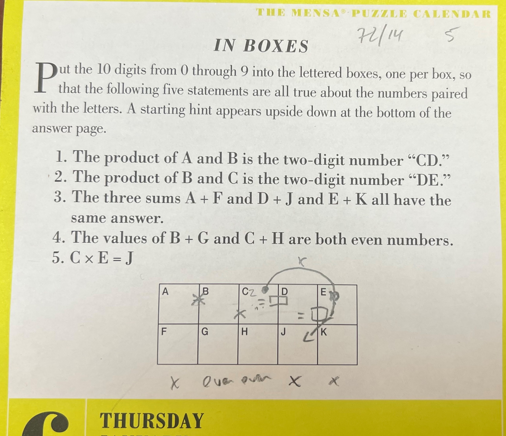

# NumberFinder
I love puzzles and wanted to find a general solution to number puzzles where certain numbers combine and add or multiply with other numbers. There are also constraints like certain numbers or combinations having to be even or odd or unique.

Here is the puzzle I was trying to solve 
(It came from the [365 Brain Puzzles calendar](https://www.amazon.com/Mensa-Brain-Puzzlers-Page-Calendar/dp/1523513241) January 6th, 2022):



### Summary Expressions

1. Digits A, B, C, D, E, F, G, H, I, J are all unique
2. A*B=CD
3. B*C=DE
4. A+F=D+I=E+J
5. B+G is even
6. C+H is even
7. C*E=I


## Input
This is what the above constraints look like in code:
```
Computer c = new();
c.Equal("A*B,CD")
 .Equal("B*C,DE")
 .Unique("A,B,C,D,E,F,G,H,I,J")
 .Equal("A+F,D+I,E+J")
 .Even("B+G,C+H")
 .Equal("C*E,I")
;
c.Calculate();
```

## Output
```
Found: 1 results with 1739 iterations
A,B,C,D,E,F,G,H,I,J
3,7,2,1,4,6,9,0,8,5
```

## Goals: 
1. Allow this to be entered in some type of easy format into the tool.
2. Allow for adding additional constraint types easily.
3. Try not to use a brute force approach.

## Structure
* Use a generic underlying constraint framework to allow for easily adding new constraints. 
* Use lambda functions to allow for flexibility in creating constraints. 
* Allow for parsing letters as well as numbers for example A*CB = 42.
* Whenever a constraint fails, return the letters causing it to fail. 
If these two letters are wrong every combination with these two letters is also wrong and doesn't need to be tested. 
This probably isn't 100% correct, but it should be avoiding most of the repetition. 
This turns out to be really hard with lots of constraints.
* Unit test the core. Testing other things turns out to be more challenging. Just finding examples is time consuming.

## Observations
* The order of the constraints matters a lot with respect to speed.
* If the first item is the unique constraint, then it takes several minutes to find the numbers. This amounts to billions of attempts.
* If the unique constraint is the 3rd item it takes about 1700 tries to find it. 


## Bugs Found
1. There is something wrong with the logic in that if the unique constraint is put lower in the order than 3 it starts to return 0 results. More work is needed. I believe this is related to skipping too many items early on with constraints that use letters higher in the alphabet.

## Areas for Improvement
1. The Constraint classes parse the input clauses each time when they assess a set of values. This could be done a single time and then reused. While likely straitforward, this would require a somewhat complex function tree that holds the constraint and then accepts the array of values to evaluate.

## Another Example
```
.Equal("8,A+B+C")
.Equal("10,A+D,B+E,C+F")
.Equal("13,C+E")
.Unique("A,B,C,D,E,F")

Found: 1 results with 201 iterations
A,B,C,D,E,F
3,1,4,7,9,6
```

Again a huge difference in the order with the unique on top it took over 21,000 iterations.
I also saw the bug in this one if the order wasn't right.

## A Third Example
Find unique numbers A and B where A9 * 7B = 4307.

```
.Unique("A,B")
.Equal("A9*7B,4307")

Found: 1 results with 11 iterations
A,B
5,3
